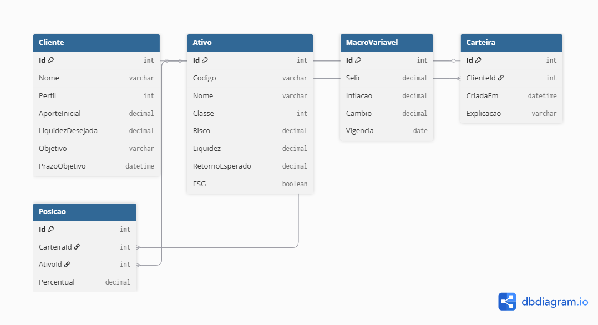

# InvestAdvisor – FIAP (C#/.NET 9 + EF Core + SQLite)

Aplicação Web API que simula um assessor de investimentos:
- CRUD de **Clientes, Ativos, Macrovariáveis, Carteiras e Posições**
- **Importação de ativos via JSON** (`Files/assets.json`)
- **Exportação** de Ativos/Carteiras em **JSON** e Carteira em **TXT** (pasta `out/`)
- **Swagger UI** (interface web)
- **EF Core + SQLite** (`advisor.db`)

---

## Como rodar
```bash
dotnet build
dotnet ef migrations add InitialCreate --project Advisor.Api
dotnet ef database update --project Advisor.Api
dotnet run --project Advisor.Api
```
Acesse: http://localhost:5098/swagger

---

## Endpoints principais

### Ativos
- `POST /api/ativos/import` (lê `Files/assets.json`)
- `GET /api/ativos`
- `GET /api/ativos/export/json` (gera `out/ativos_export.json`)

### Clientes
- `POST /api/clientes`
- `GET /api/clientes`

### Macrovariáveis
- `POST /api/macros`
- `GET /api/macros`

### Carteiras
- `POST /api/carteiras`
- `GET /api/carteiras` / `GET /api/carteiras/{id}`
- `GET /api/carteiras/export/json` (gera `out/carteiras_export.json`)
- `GET /api/carteiras/{id}/export/txt` (gera `out/carteira_{id}.txt`)

---

## Exemplo de criação

### Cliente
```json
{
  "nome": "Bruno",
  "perfil": 1,
  "aporteInicial": 5000,
  "liquidezDesejada": 0.7,
  "objetivo": "Aposentadoria",
  "prazoObjetivo": "2030-01-01"
}
```

### Carteira
```json
{
  "clienteId": 1,
  "explicacao": "Carteira de aposentadoria",
  "posicoes": [
    { "ativoId": 1, "percentual": 0.5 },
    { "ativoId": 2, "percentual": 0.3 },
    { "ativoId": 3, "percentual": 0.2 }
  ]
}
```

---

## Arquitetura (resumo)
- **Domain/Models**: entidades (`Cliente`, `Ativo`, `Carteira`, `Posicao`, `MacroVariavel`)
- **Infrastructure**: `AdvisorDbContext.cs` (EF Core)
- **Files**: `assets.json` (base de importação)
- **out**: arquivos de export (JSON/TXT)
- **Program.cs**: endpoints (Minimal APIs) + Swagger

Relações:
- Cliente 1—N Carteiras  
- Carteira 1—N Posições  
- Posição N—1 Ativo  
- MacroVariável (tabela independente)

---

## Boas práticas e conformidade
- `ReferenceHandler.IgnoreCycles` e `[JsonIgnore]` para evitar ciclos JSON
- Uso de `Explicacao` na Carteira para transparência (XAI)
- Dados locais (SQLite); sem dados sensíveis (LGPD)

---

## Diagrama
O diagrama de entidades-relacionamentos está em `docs/diagrama.png` e também incluído no README:



